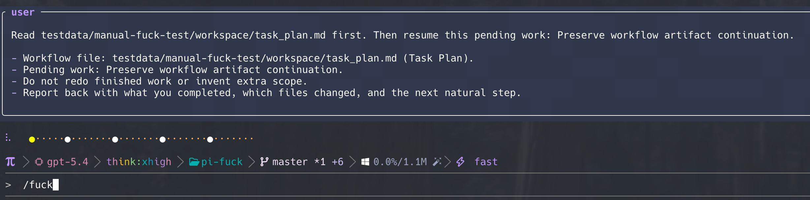

# pi-fuck

<p align="center">
  
</p>

[](https://www.npmjs.com/package/pi-fuck)
[](https://www.npmjs.com/package/pi-fuck)

`pi-fuck` is a Pi extension that turns `fuck` into an automatic continuation command.

## Why this exists

Because this annoying shit keeps happening:

- Your task runs long, the context blows up, the model gets noticeably dumber, and now you have to open a fresh session and manually `@` files again just to explain where the work should continue.
- A long task finishes a chunk, and then you still have to ask the model to write a stupid little `compact` summary of what it already did, what is still pending, and where the next session should pick things up.
- You already did the brainstorm, the planning, the workflow ceremony, maybe even used Superpowers or compound-engineering, the todos are still sitting right there unfinished, and the model still goes: "Yes, I can continue. Anything else you want me to do?" Come on. Just continue.

`pi-fuck` exists to kill that handoff friction. Instead of re-explaining the situation like a human glue script, you open a fresh session, type `fuck`, and move on.

## What it does

In a fresh Pi session, run:

```text
/fuck
```


You can also provide an explicit goal:

```text
/fuck finish the next test slice and run verification
```


The extension will automatically:

1. find the most recent session in the current workspace that is not the current session
2. read that session's visible context
3. compose the concrete next user message needed to continue the work
4. send that message directly in the current session

This removes the manual copy → summarize → paste workflow.

## Inspired by

Inspired by [`thefuck`](https://github.com/nvbn/thefuck). Thanks to that project for the naming joke and the original spark behind turning `fuck` into a fast recovery and continuation gesture.

## Prompt file

The handoff system prompt lives in a separate file so it can be iterated independently:

- `handoff-system-prompt.md`

## Installation

Install from npm:

```bash
pi install npm:pi-fuck
```

Or from git:

```bash
pi install git:github.com/vurihuang/pi-fuck
```

Restart Pi after installation so the extension is loaded.

### Load it for a single run

```bash
pi -e npm:pi-fuck
```

### Install from a local path

```bash
pi install /absolute/path/to/pi-fuck
```

You can also install from the current directory while developing:

```bash
pi install -l .
```

### Load from a local path for one session

```bash
pi -e /absolute/path/to/pi-fuck
```

## Verify installation

After restarting Pi, open a fresh session and run:

```text
/fuck
```

If the command is available and the extension can continue from an earlier workspace session, the installation is working.

## Usage

Start a new session and run:

```text
/fuck
```


If you want to steer the continuation goal, pass it inline:

```text
/fuck continue with a planning pass before implementation
```


The slash command and the plain-text trigger behave the same way. The extension looks at the most recent earlier session in the current workspace and turns that prior context into the next concrete user message.

### Example flow

#### 1. Continue work with no extra instruction

Previous session ended halfway through a task. In a fresh session, run:

```text
/fuck
```

Typical result:

- the extension finds the latest earlier workspace session
- it reads the visible context from that session
- it sends a concrete continuation message into the current session
- Pi resumes the work without you manually summarizing anything

#### 2. Continue, but force verification next

If the previous session already implemented most of the code and you want the new session to focus on verification, run:

```text
/fuck run the required checks, fix failures, then finish the task
```

This biases the generated continuation message toward type-checking, linting, tests, and remaining fixes.

#### 3. Continue with a planning-first handoff

If the previous session explored an idea but you want the new session to plan before coding, run:

```text
/fuck first write a short implementation plan, then execute the next slice
```

This is useful when the earlier session left behind partial research, unclear scope, or a rough idea that needs structure.

## Notes

- The slash command is `/fuck`
- Plain `fuck` input is also intercepted and handled
- The extension excludes the current session and uses the most recent earlier session in the same workspace
- The continuation strategy is intentionally flexible: it can continue implementation, debugging, review, planning, research, or brainstorming depending on the previous session and any explicit goal you provide
- `/fuck` prefers explicit workflow artifacts and compact recent evidence over summarizing the entire prior session history
- All user-facing content and prompt instructions are kept in English

## Install as a pi package

This project is already structured as a pi package via the `pi` field in `package.json`:

```json
{
  "pi": {
    "extensions": ["./fuck.js"]
  }
}
```

That means Pi can install it from a local path, npm, or git using the standard pi package flow.
